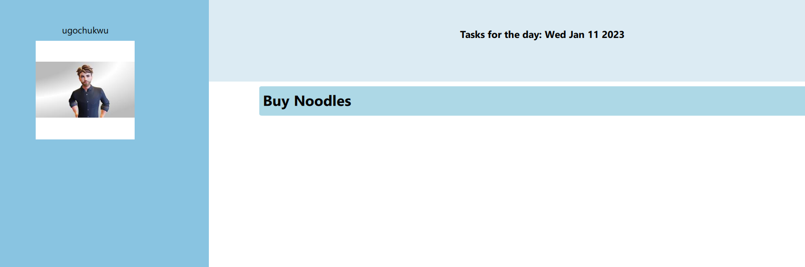

# TO-DO APP

## FEATURES
1. Shows the date on the computer
2. User can add, delete or edit an entry
3. This application can run free on your system without internet
4. The application can be released for Windows or for Apple (using Qt)
5. The To-Do app is capable of data persistent, however it achieves this using .txt files

# ANIMATION

## STACK
Qt, QML, C++ 

## INSTALLATION
You can deploy the Qt application for Windows, IoS or Linux . Watch guide here: https://youtu.be/9G9_7czvGpY

## HOW TO CONTRIBUTE
1. Clone the Repository using minimum of Qt 6.3
2. Make the changes
3. Create a pull Request
4. Feel free to reach out
5. Incoporate a quit Button, Back Buttons

## Possible improvements
1. GUI Advancements
2. Replacig the DB format by introducing a real DB rather than storing data with .txt files
3. Intoducing categories into the tasks
